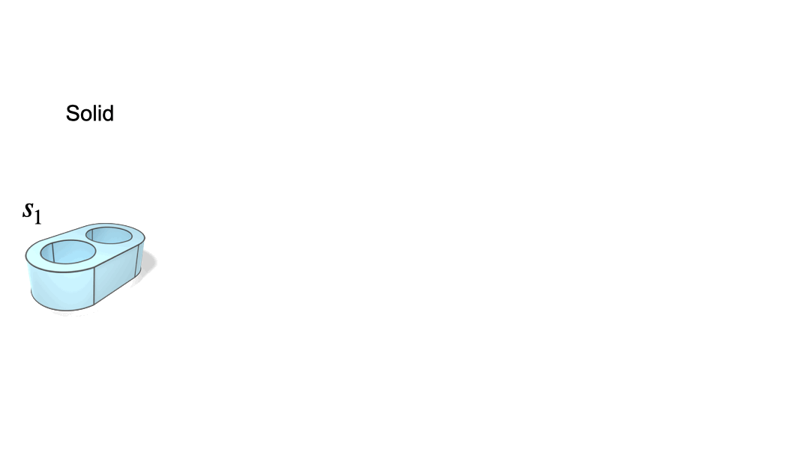
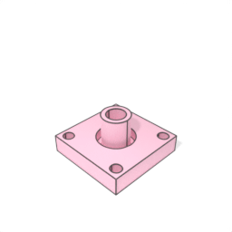
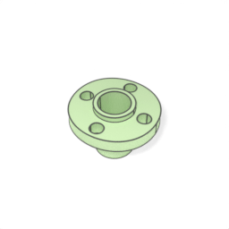

# BrepVis: B-rep Visualization Tool

A visualization toolkit for CAD B-rep (Boundary Representation) models in STEP format.
Uses [Blender](https://www.blender.org/) for rendering and [Polyscope](https://github.com/nmwsharp/polyscope) for interactive 3D viewing. Written in Python, this toolkit was used to generate visualizations for the paper:

**BrepDiff: Single-stage B-rep Diffusion Model**
SIGGRAPH 2025

[Mingi Lee<sup>*</sup>](https://mingilikesmangos.github.io/), [Dongsu Zhang<sup>*</sup>](https://dszhang.me/about), [Clément Jambon<sup>*</sup>](https://clementjambon.github.io/), [Young Min Kim](https://3d.snu.ac.kr/members/)
<sup>*</sup>Equal contribution

[[Project Page]](https://brepdiff.github.io/) · [[Paper]](https://dl.acm.org/doi/10.1145/3721238.3730698) · [[Code]](https://github.com/brepdiff/brepdiff)

<table>
  <tr>
    <td rowspan="2">
      
    </td>
    <td>
      
    </td>
  </tr>
  <tr>
    <td>
      
    </td>
  </tr>
</table>

**Note:** Assumes single-solid STEP files.


## Installation

### Prerequisites
Tested with the following versions:
- Python 3.9
- pythonOCC 7.8.1
- Blender 3.4.0 (for rendering)

### Dependencies
```bash
pip install -r requirements.txt
```

**Note:** NumPy 1.23.5(<2) is required for Blender 3.4.0 compatibility. If pip installs multiple versions, keep only 1.23.5.

### pythonOCC
```
conda install -c conda-forge pythonocc-core=7.8.1
```

### Blender
```angular2html
wget https://download.blender.org/release/Blender3.4/blender-3.4.0-linux-x64.tar.xz
tar -xvf blender-3.4.0-linux-x64.tar.xz                                                                                                                                                                           
ln -sr ./blender-3.4.0-linux-x64/blender ./blender
rm -rf blender-3.4.0-linux-x64.tar.xz  
```

## Quick Start

```bash
# Render a single STEP file
python vis_step.py render samples/example.step

# Interactive viewer
python vis_step.py view samples/example.step

# Create rotating video
python vis_step.py render-video samples/example.step

# Run comprehensive test suite (demonstrates all features)
./test.sh
```

## Usage

### 1. Static Rendering

Render STEP files using Blender.

#### Single File

```bash
# Basic rendering
python vis_step.py render samples/example.step

# With color and transformations
python vis_step.py render samples/example.step \
  --color pink \
  --stand-upright \
  --resolution 512
```

#### Batch Processing

```bash
# Render all STEP files in directory
python vis_step.py render samples/ \
  --n-steps 100 \
  --max-workers 8 \
  --color blue

# Fast (coarse mesh)
python vis_step.py render samples/ --fast
```

#### Available Options

| Option | Description | Default |
|--------|-------------|---------|
| `--color` | Color preset: `blue`, `pink`, `orange`, `green`, `silver` | `blue` |
| `--resolution` | Render resolution (width × height) | `256` |
| `--rotation-angle` | Camera rotation in degrees | `0.0` |
| `--camera-distance` | Camera distance from model | `3.0` |
| `--camera-height` | Camera height (Z position) | `2.0` |
| `--camera-base-angle` | Camera base angle in degrees | `-45.0` |
| `--ground-plane-z` | Ground plane Z position after normalization | `-0.5` |
| `--stand-upright` | Rotate 90° around X-axis | `False` |
| `--flip-z` | Flip along Z-axis (mirror XZ plane) | `False` |
| `--no-normalize` | Keep original scale/position | `False` |
| `--color-mode` | `rgb` (white background) or `rgba` (transparent) | `rgb` |
| `--fast` | Fast mode (coarser mesh) | `False` |
| `--explode` | Render exploded view (faces/edges separately) | `False` |
| `--partial` | Render specific faces only (e.g., `"0,2,4"`) | `None` |
| `--max-workers` | Parallel workers for batch processing | `4` |
| `--keep-intermediate` | Keep intermediate NPZ files | `False` |
| `--verbose` | Print step info | `False` |

### 2. Interactive Viewer

Launch an interactive 3D viewer using Polyscope.

```bash
# Basic viewer
python vis_step.py view samples/example.step

# Show only edges (no mesh)
python vis_step.py view samples/example.step --no-show-mesh

# Show only mesh (no edges)
python vis_step.py view samples/example.step --no-show-edges
```

### 3. Video Rendering

Create rotating animations of STEP files.

```bash
python vis_step.py render-video samples/example.step
```

**Requirements:** Install ffmpeg: `sudo apt install ffmpeg`

| Option | Description | Default |
|--------|-------------|---------|
| `--output-path` | Custom output path | `<input>.mp4` |
| `--fps` | Frames per second | `24` |
| `--duration` | Duration in seconds | `3.0` |
| `--video-format` | Format: `mp4` or `gif` | `mp4` |
| `--color` | Color preset | `blue` |
| `--resolution` | Resolution | `256` |
| `--camera-distance` | Camera distance from model | `3.0` |
| `--camera-height` | Camera height (Z position) | `2.0` |
| `--camera-base-angle` | Camera base angle in degrees | `-45.0` |
| `--ground-plane-z` | Ground plane Z position after normalization | `-0.5` |

### 4. Exploded Views

Render individual faces, edge loops, and edges separately.

```bash
python vis_step.py render samples/example.step --explode --color orange
```

Creates output directory with:
- `face_0.png`, `face_1.png`, ... (mesh + edges for each face)
- `face_0_loop.png`, ... (edge loop only)
- `face_0_edge_0.png`, ... (individual edges)


### Quality Parameters

Fine-tune mesh tessellation quality:

```bash
python vis_step.py render samples/example.step \
  --edge-deflection 0.0001 \
  --mesh-linear-deflection 0.01 \
  --mesh-angular-deflection 0.1
```

Lower values = higher quality + slower processing.


## Citation

If you find this visualization toolkit useful, please consider giving a shout-out or citing our work:

```bibtex
@inproceedings{lee2025brepdiff,
    author = {Lee, Mingi and Zhang, Dongsu and Jambon, Cl\'{e}ment and Kim, Young Min},
    title = {BrepDiff: Single-Stage B-rep Diffusion Model},
    year = {2025},
    publisher = {Association for Computing Machinery},
    url = {https://doi.org/10.1145/3721238.3730698},
    doi = {10.1145/3721238.3730698},
    booktitle = {Proceedings of the Special Interest Group on Computer Graphics and Interactive Techniques Conference Conference Papers},
    series = {SIGGRAPH Conference Papers '25}
}
```